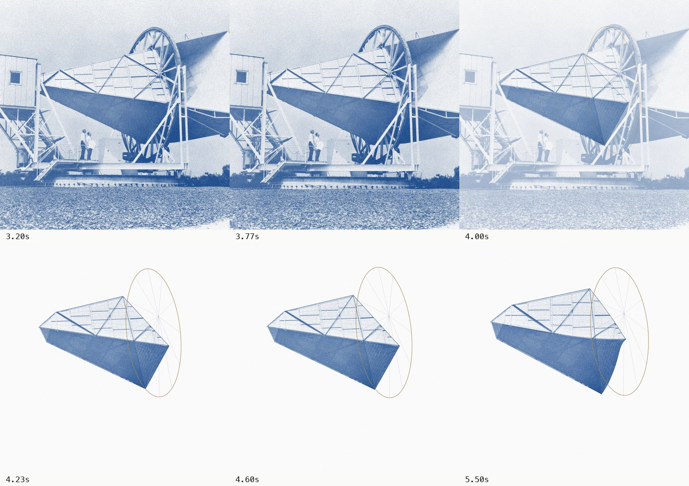

# Horn handoff: continuity review

7 September 2026. Review of the current 18-second export, not an implementation change.

## Finding

The handoff is position-matched but not fully shape-matched. The photograph includes the large right-hand flare, dense support wheel, people, base and buildings. The reconstruction keeps three central tapered faces and reduces the wheel to a thin hoop. When the photograph fades, part of the recognizable apparatus disappears along with its background. This reads as isolating a fragment before animating it.

The source confirms three sequential stages: the photograph fades at 3.746–4.232s; camera orbit begins at 4.232s with zero initial eased velocity; the earliest deformation starts at 4.573s and becomes perceptible later. The shared zoom continues, so this is not a literal held frame. However, the zoom decelerates and does not supply enough depth to disguise the change of visual representation. A whole-scene fade also removes the setting simultaneously and briefly reduces the horn’s contrast during compositing.

Review coverage: revisited the decoded handoff frame sequence, examined selected frames enlarged, and checked the actual animation timings in index.html. The accompanying contact sheet contains square crops at 3.20, 3.77, 4.00, 4.23, 4.60 and 5.50 seconds, without stretching their aspect ratio.

## References and resources

1. [Saul Bass: North by Northwest, Art of the Title](https://www.artofthetitle.com/title/north-by-northwest/). The article describes the graphic grid dissolving into matching building windows. Its key lesson here is structural correspondence: a mark gets reinterpreted while retaining its location and shape. For our film, the photographed flare, panel seams and wheel need equivalents before abstraction begins. Article read; the Vimeo clip could not be retrieved, so no frame-level viewing of that reference is claimed.

2. [School of Motion: Match Cuts](https://schoolofmotion.com/blog/match-cuts). Practitioner tutorial on preserving position and momentum across an edit, with movement and framing examples. Read the tutorial; its companion project files require email access and were not downloaded. Applying the principle here: overlap the change in representation with a continuing move rather than completing the fade before starting the orbit.

3. [Universal Everything: Walking City](https://www.universaleverything.com/art/walking-city). The studio describes an evolving building whose material, pattern and geometry change in motion. The useful reference is continuity of subject and behavior. Official description reviewed; full Vimeo playback was unavailable. This does not justify discarding recognizable antenna components simply because the replacement surface is attractive.

4. [BUCK: IBM Think](https://www.buck.co/work/ibm-think). The official project describes physically grounded material and perspective studies. Reviewed the complete 2.267-second public study at 10 sampled frames per second, saved as buck-think-study.mp4 and buck-think-contact.jpg. Folded, extruded forms retain paper-like edges and shading, followed by a cut to the wordmark. It is a material/structure reference, not evidence for a seamless photographic transformation. Media source: https://stream.mux.com/CInEBLxhE1RZ9cI7GDtqFJWnbq25DsKbdsGDF01901OuY/low.mp4 . Local review only; no studio imagery is incorporated in our teaser.

5. [Ordinary Folk: Process](https://www.ordinaryfolk.co/process). The studio resolves message and design through sketches/storyboards before animation, and uses an animatic during production. The practical response to this review is a short transition study with a clear before/intermediate/after design, rather than another timing-only full export.

## Recommended next treatment

Keep the moving recognition shot, then let the camera approach a recognizable panel seam or the lip, off-axis. The material should progressively occupy more of the frame while the outside world moves toward the edges. Retain the complete source silhouette in the transition model, especially the right-hand flare; preserve the heavy wheel until its transformation into a rim is visible.

Begin the gentle turn during the photographic-to-depth handoff. Match position, scale, direction and contrast while both representations overlap. The first bend should begin before the last photographic context clears, so motion carries the change. Reveal the complete evolving instrument afterward. This is a close pass along a visible surface, not a trip through the horn mouth into black. The approved final framing remains fully inside the page.

Alternative: reconstruct the entire apparatus and progressively simplify its background while orbiting it. This keeps more historical context but requires more geometry and careful layer depth. The close surface pass is the more focused and economical treatment, provided it does not hide an incomplete model.

## Acceptance checks for a short prototype

- The big flare and support wheel do not disappear as accidental casualties of the background fade.
- A specific panel edge remains trackable across the transition in position, direction and scale.
- The horn does not visibly lighten or become transparent at the midpoint.
- Camera motion continues across the handoff and the first bend overlaps it.
- No isolated cutout stage, empty/black interlude, or replacement object.
- The complete final horn continues to fit both output formats.

These are proposed changes. The current source and MP4 were not altered during this review.

## Implemented surface pass

The subsequent implementation extends the connected photographic surface to the right-hand flare, retains a textured support band and spokes, and removes those same regions from the separate background layer. The instrument stays opaque while the environment fades. A camera push along the panel begins before the first deformation, then returns to the established final framing. A 180-frame, six-second study was visually inspected before the full export. The historical diagnosis above refers to the earlier cut; see ../../frame-review.md for the current export checks.
